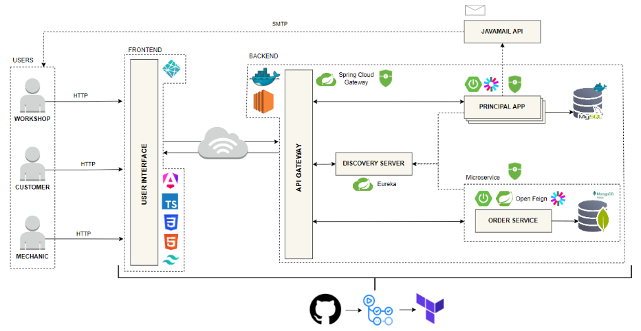

# iMechanic

iMechanic is a comprehensive cloud-native platform that connects vehicle owners with automotive service providers through a modern microservices architecture. The system is built using Spring Boot for backend services and Angular for the frontend, following domain-driven design principles.

## 🚀 Core Features

- **User Management**: Secure authentication and authorization system with role-based access control
- **Service Management**: Complete workflow for creating, assigning, and tracking automotive services
- **Vehicle Management**: Vehicle registration and maintenance history tracking
- **Workshop Operations**: Tools for workshops to manage mechanics, services, and customer interactions
- **Real-time Updates**: Live status updates for service requests and vehicle repairs

## 🏗️ System Architecture

The platform is built using a microservices architecture with the following key components:

### 1. Frontend (Angular)
- Modern, responsive web interface built with Angular
- Role-based views for customers, mechanics, and workshop managers
- Real-time updates using WebSockets
- JWT-based authentication

### 2. API Gateway (Spring Cloud Gateway)
- Single entry point for all client requests
- Request routing and load balancing
- Authentication and authorization
- Rate limiting and circuit breaking

### 3. Principal Service
- Handles core business logic for users, workshops, and mechanics
- Manages authentication and authorization
- Handles user profiles and preferences
- Integrates with the order service for service management

### 4. Order Service
- Manages service orders and work assignments
- Tracks service status and progress
- Handles service assignments to mechanics
- Manages service history and documentation

### 5. Discovery Server (Eureka)
- Service registry and discovery
- Load balancing between service instances
- Service health monitoring

## 🔄 Business Workflow

1. **Customer Journey**:
   - Register/Login to the platform
   - Add vehicle details
   - Request service/repair
   - Track service status in real-time
   - Receive service completion notification
   - Make payment and provide feedback

2. **Mechanic Workflow**:
   - View assigned services
   - Update service status
   - Document work performed
   - Request additional parts/approvals
   - Complete service documentation

3. **Workshop Management**:
   - Manage mechanics and their schedules
   - Oversee service queue and assignments
   - Monitor service quality and efficiency
   - Generate reports and analytics



## 🛠️ Technical Stack

- **Frontend**: Angular, Angular CLI, TypeScript, RxJS, Angular Material
- **Backend**: 
  - Java 17
  - Spring Boot 3.x
  - Spring Cloud (Gateway, Eureka, Config)
  - Spring Security with JWT
  - Spring Data JPA & MongoDB
  - MySQL & MongoDB
  - MapStruct for DTO mapping
  - Lombok for boilerplate reduction
  - Maven for dependency management

## 🚀 Getting Started

### Prerequisites
- JDK 17+
- Node.js 16+
- Docker & Docker Compose
- MySQL 8.0+
- MongoDB 5.0+


## 🤖 CI/CD & Infrastructure as Code

### GitHub Actions Workflows

The project uses GitHub Actions for CI/CD with the following workflows:

1. **Service Deployments**
   - `api-gateway.yml`: Builds and deploys the API Gateway service
   - `discovery-server.yml`: Manages the Eureka service registry
   - `order-service.yml`: Handles order service deployment
   - `principal-service.yml`: Deploys the authentication and user management service
   - `db-main.yml`: Manages the main database setup
   - `mongodb-order.yml`: Handles MongoDB deployment for orders

2. **Automated Testing**
   - Runs on every push and pull request
   - Executes unit and integration tests
   - Performs code quality checks

3. **Infrastructure Deployment**
   - `deploy.yml`: Handles EC2 instance deployment and service updates
   - Automated rollback on deployment failures

### Infrastructure as Code with Terraform

The `iac/` directory contains Terraform configurations for provisioning and managing cloud resources:

```
└── 📁iac
    ├── instance.tf       # EC2 instance configuration
    ├── key.tf            # SSH key management
    ├── main.tf           # Main Terraform configuration
    ├── outputs.tf        # Output variables
    ├── provider.tf       # Cloud provider configuration
    ├── security_group.tf # Security group rules
    └── variables.tf      # Variable definitions
```

#### Key Features:
- **Automated Infrastructure Provisioning**
  - EC2 instance setup with proper IAM roles
  - Security groups with least-privilege access
  - Automated networking configuration

- **Deployment Pipeline**
  1. Infrastructure provisioning via Terraform
  2. Docker container deployment
  3. Zero-downtime deployments

#### Usage:
```bash
# Initialize Terraform
cd iac
terraform init

# Plan and apply changes
terraform plan
terraform apply
```
