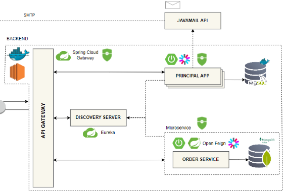

# iMechanic - Microservices Architecture

This repository contains the backend microservices for the iMechanic platform, built with Spring Boot and Spring Cloud. The architecture follows microservices principles with service discovery, API Gateway, and containerized deployment.

## 🏗️ Architecture Overview



## 🛠️ Core Technologies

- **Java 17** - Primary programming language
- **Spring Boot 3.3.0** - Framework for building microservices
- **Spring Cloud 2023.0.2** - For cloud-native patterns
- **Spring Security** - Authentication and authorization
- **JWT** - JSON Web Tokens for stateless authentication
- **Feign Client** - Declarative REST client
- **Docker** - Containerization
- **Eureka** - Service discovery
- **Spring Cloud Gateway** - API Gateway

## 📦 Services

### 1. API Gateway (`api-gateway`)
The entry point for all client requests, handling routing, load balancing, and security.

### 2. Service Discovery (`discovery-server`)
Eureka-based service registry for dynamic service discovery.

### 3. Order Service (`order-service`)
Manages order processing, tracking, and history.

### 4. Principal Service (`principal-service`)
Handles authentication, authorization, and user management.

## 🔐 Security Implementation

### JWT Authentication Flow
1. Client authenticates with credentials
2. Server validates and returns JWT
3. Client includes JWT in `Authorization` header
4. Gateway validates JWT and forwards requests

### Role-Based Access Control (RBAC)
- **ROLE_CLIENT** - Basic user access
- **ROLE_MECHANIC** - Service provider access
- **ROLE_ADMIN** - Administrative access

## 🐳 Docker & Containerization

### Running with Docker Compose
```bash
docker-compose up -d
```

### Database Containers
- **PostgreSQL** - For structured data
- **MySQL** - For relational data
- **MongoDB** - For flexible schema data

## 🚀 Development Setup

### Prerequisites
- Java 17+
- Maven 3.8+
- Docker & Docker Compose
- IntelliJ IDEA (recommended) or any Java IDE

### Building the Project

#### Using Command Line
```bash
# Build all services
mvn clean install

# Build specific service
cd <service-directory>
mvn clean package
```

#### Using IntelliJ IDEA
1. **Import Project**
   - Open IntelliJ IDEA
   - Select `File` > `Open` and choose the root `pom.xml`
   - Select "Open as Project"
   - Enable "Import Maven projects automatically"
   - Click "OK" to import

2. **Run Configuration**
   - For each service, create a new Spring Boot run configuration:
     1. Click `Add Configuration` in the toolbar
     2. Click `+` and select `Spring Boot`
     3. Set the main class (e.g., `ApiGatewayApplication`)
     4. Set the module to the corresponding service module
     5. Click `Apply` and `OK`

3. **Running Services**
   - Start the discovery server first
   - Then start other services in any order
   - Use the Maven tool window to run Maven goals if needed

### Running Locally
1. Start the service discovery first
2. Start other services in any order
3. The API Gateway will be available at `http://localhost:8080`

## 🌐 API Documentation

API documentation is available via Swagger UI when running locally:
- API Gateway: `http://localhost:<dynamic-port>/swagger-ui.html`
- Order Service: `http://localhost:<dynamic-port>/swagger-ui.html`
- Auth Service: `http://localhost:<dynamic-port>/swagger-ui.html`

## 🔄 Inter-Service Communication

### Using Feign Client
```java
@FeignClient(name = "order-service")
public interface OrderServiceClient {
    @GetMapping("/api/orders/{id}")
    Order getOrder(@PathVariable("id") Long id);
}
```
